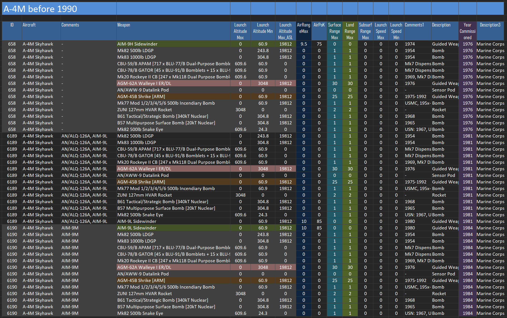
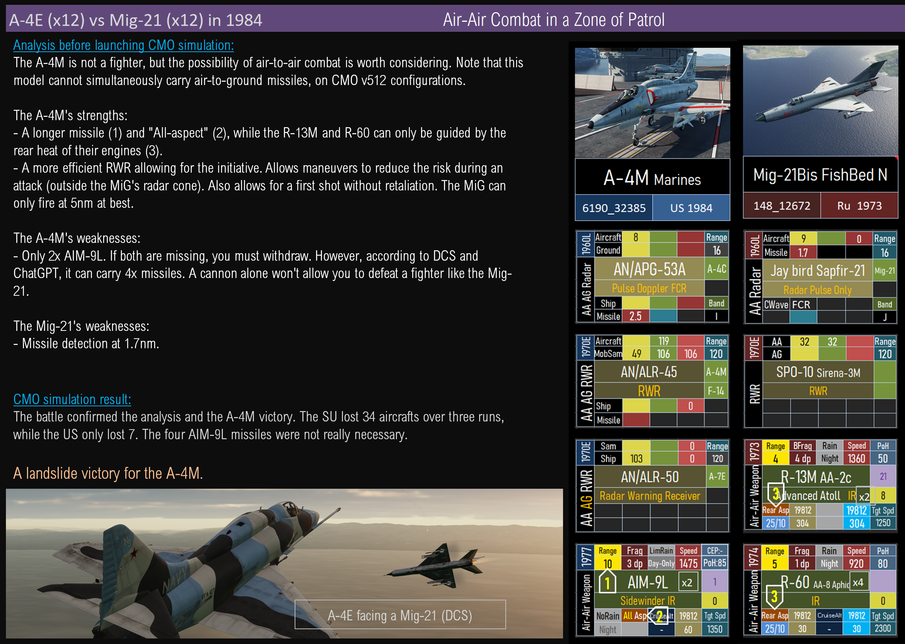
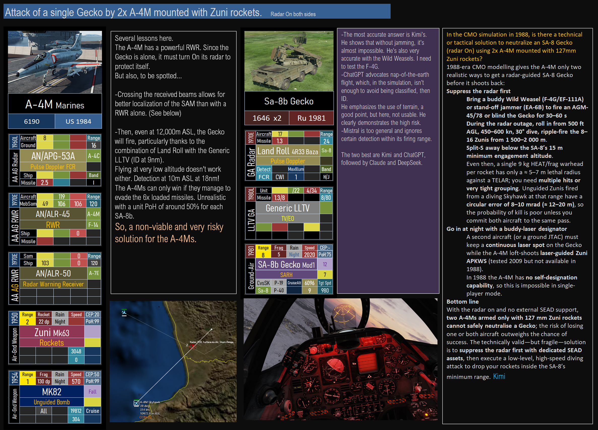

# A-4M
	-  #A-4E, #A-4
	- ## A-4M Armament
		-  #AGM-62A, #AGM-45B, #Zuni, #AIM-9L
	- ## Air-Air Combat
		- ## --> [[Mig-21]]   #AIM-9L
			- {:height 600, :width 1170} #AIM-9, #R-13
	- ## Air-Ground Combat
		- ## --> [[Gecko]] {:height 864, :width 1189} #A-4, #SA-8b, #AI_Answer
			- alias:: SA-8b, Osa
	-
-