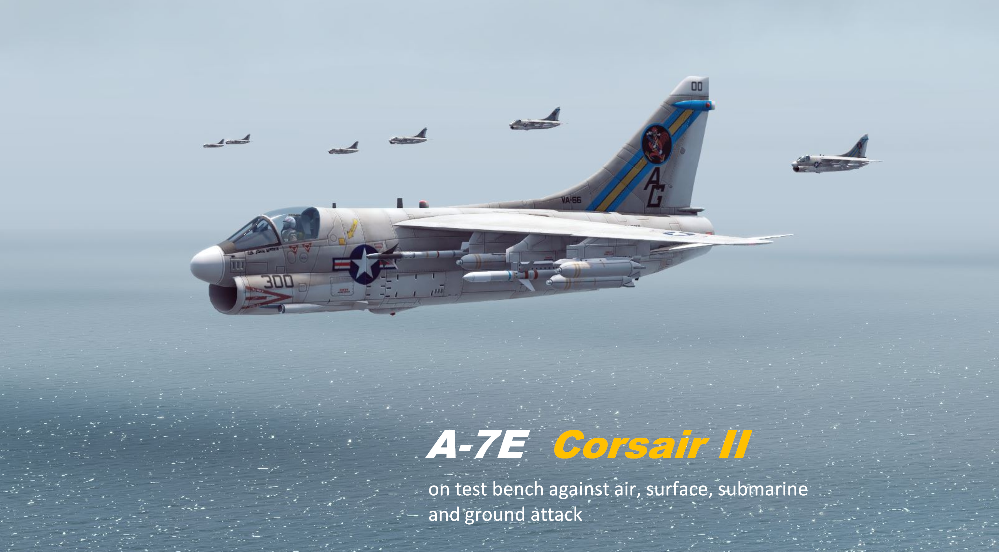
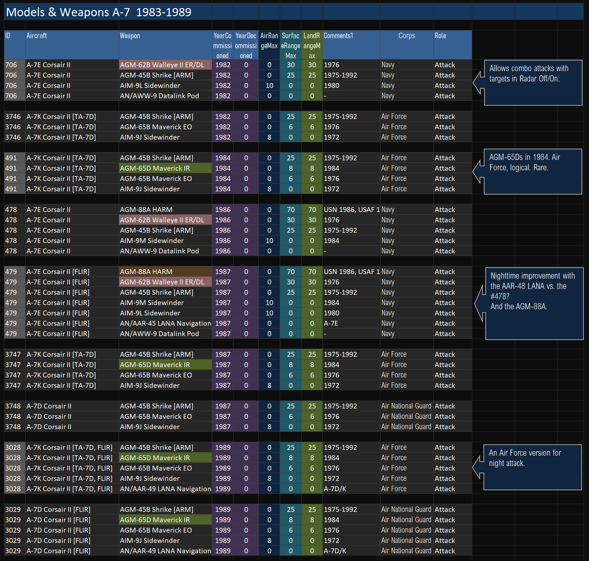
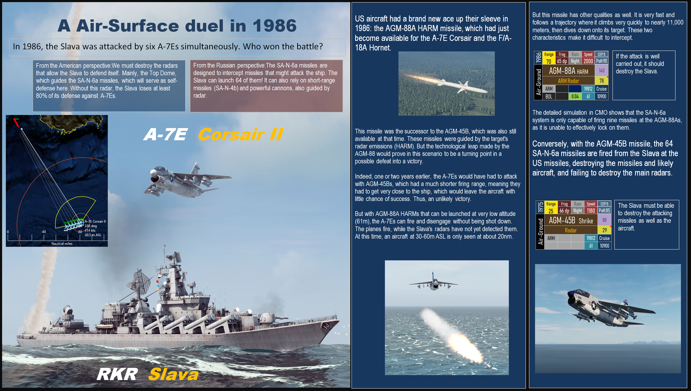
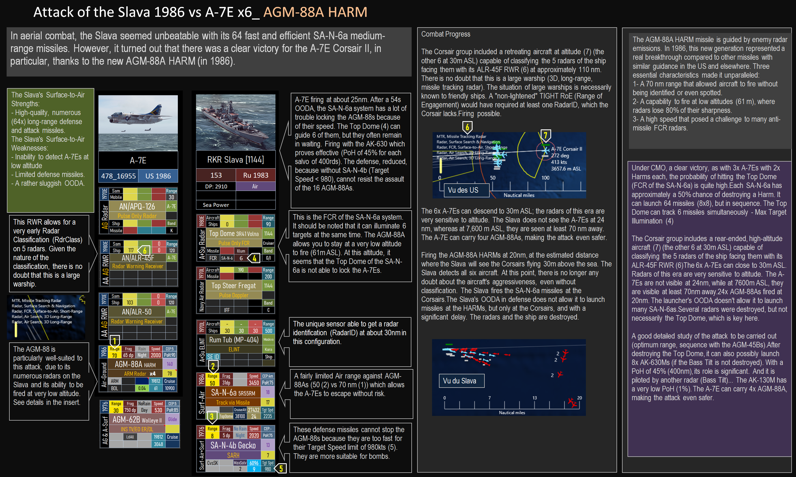
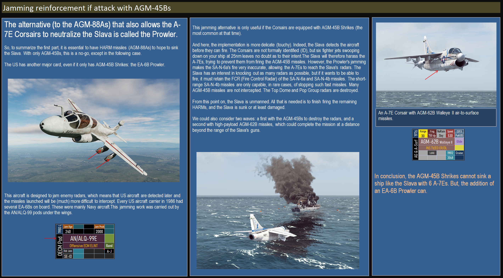
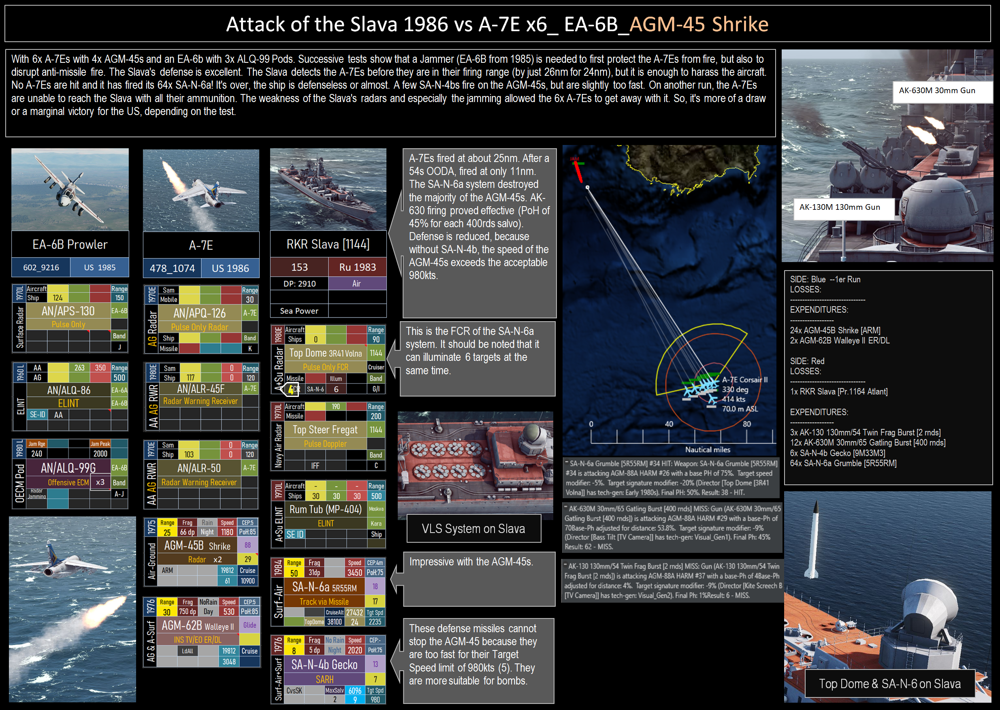
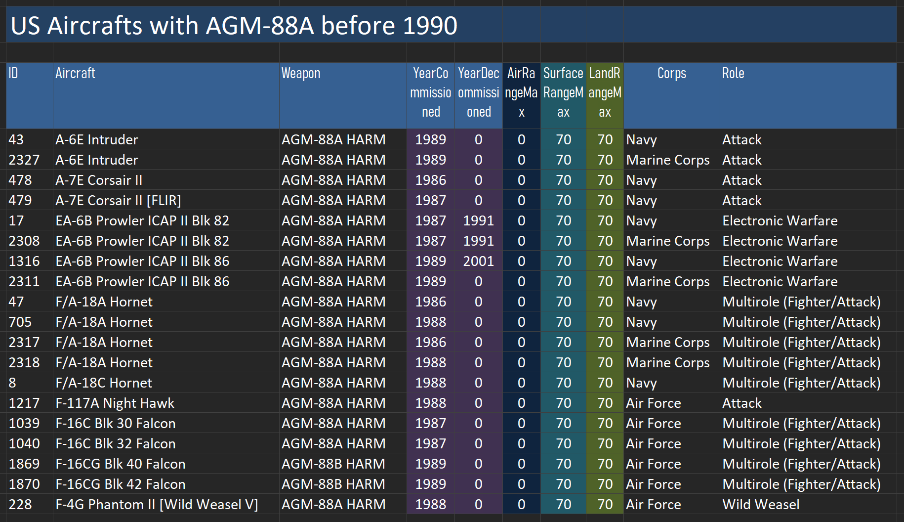
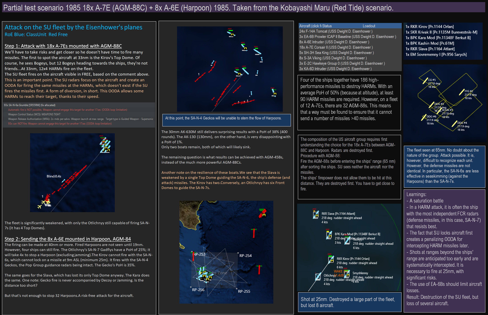

# A-7
	- alias:: A-7E
	- 
	  collapsed:: true
		-  #AGM-65D, #AGM-88A, #AGN-62B, #AAR-49_LANA, #AGM-45B
	- ## Air-Air Combat
	- ## Air-Surface Combat
		- ##  Slava  #Slava, #AGM-88
			-  #AGM-88, #SA-N-6, #AGM-45
			-  #Jamming, #ALQ-99, #EA-6B
			-  #Jamming, #ALQ-99, #EA-6B, #Top_Dome, #SA-N-4
			- ## Possible duels variants 
			- 
			  id:: 68971da0-d2ed-4930-a96f-948b33a28872
			- 
			- 
		- ## Massive attack (A-7E+A-6E) on a soviet fleet    #A-6E, #AGM-84, #SA-N-7, #SA-N-6, #Kirov, #Kara, #Kashin, #Krivak_II, #Sovremenny
-