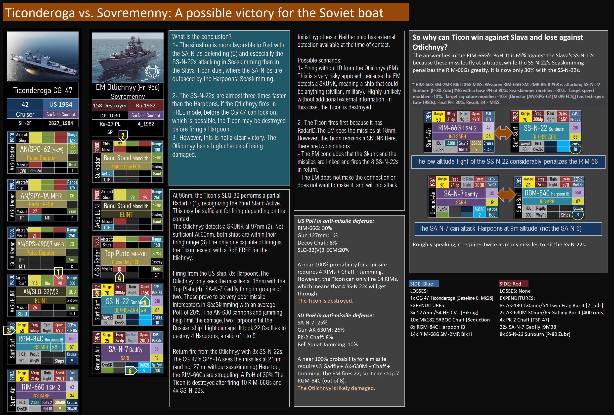
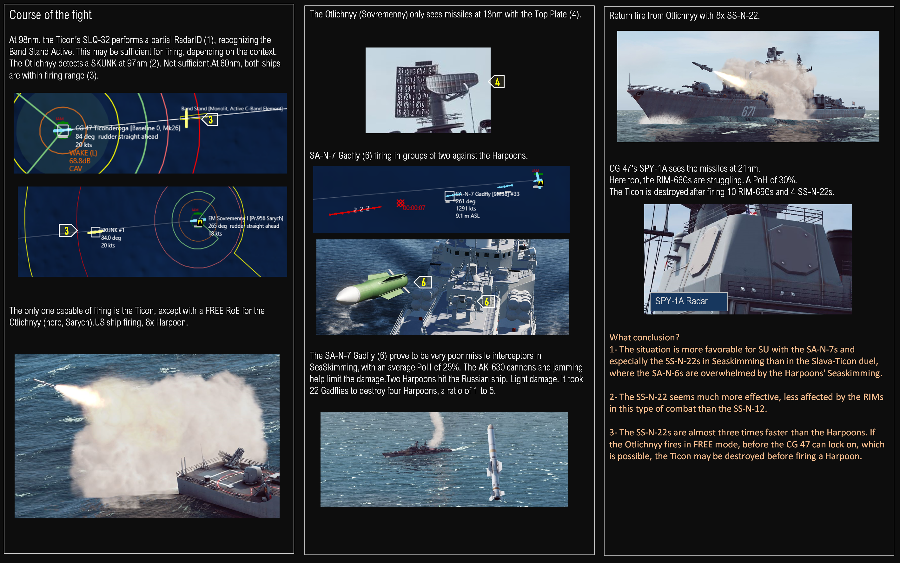
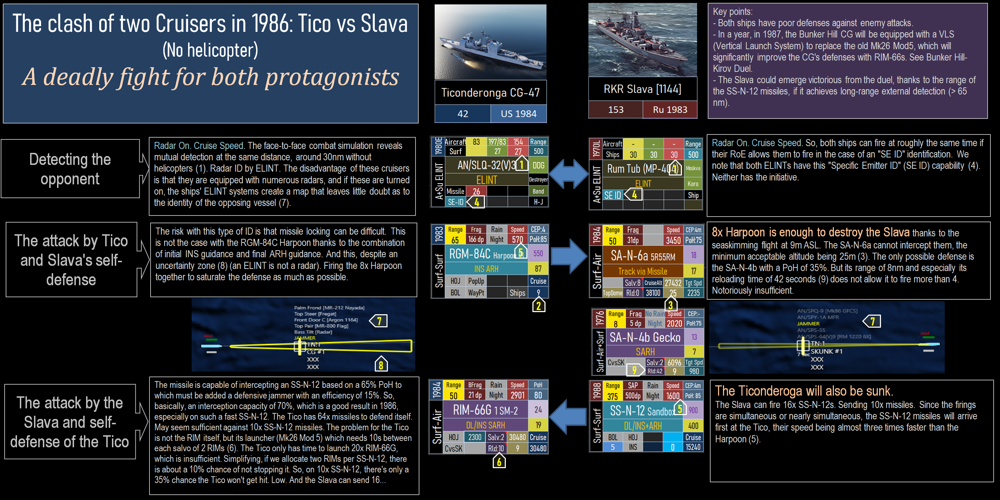
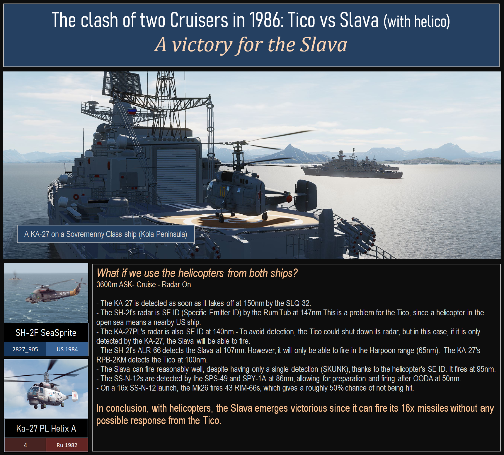
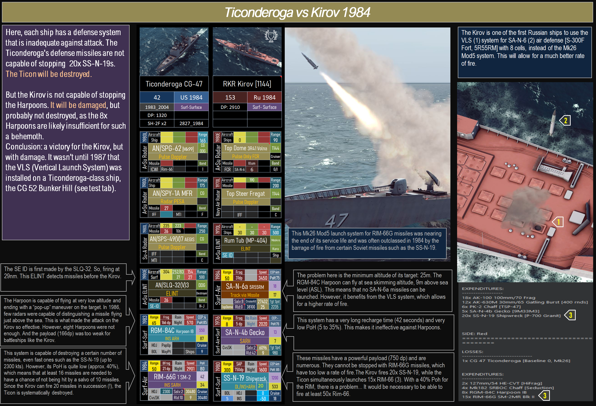

- Ticonderoga
	- alias:: Ticon, CG-47
	- 
	- ## Surface-Surface Combat
		- ### -->Sovremenny (Otlichnyy) 1982 #RMG-84, #SS-N-22, #RIM-66, #SA-N-7
		  collapsed:: true
			- 
			- {:height 825, :width 1217}
				- 
				- 
		- ### -->Slava 1986
		  collapsed:: true
			- #SH-2F, #Ka-27, #RGM-84, #SA-N-6, #SA-N-4, #SS-N-12, #RIM-66G  {:height 1136, :width 1248} [[Specific Emitter ID (Radar ID)]]
		- ### -->Kirov 1984
		  collapsed:: true
			- 
			- 
	- ## Surface-Air Combat
	- ## Surface-Sub Combat
-